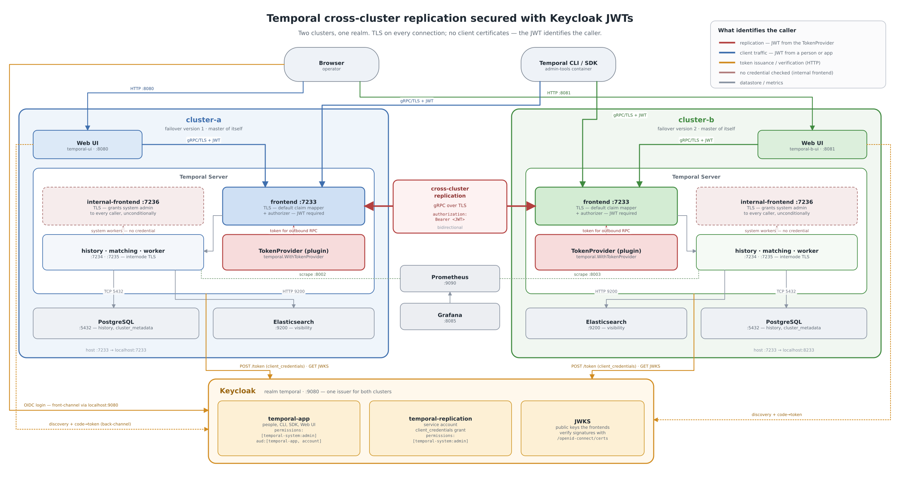
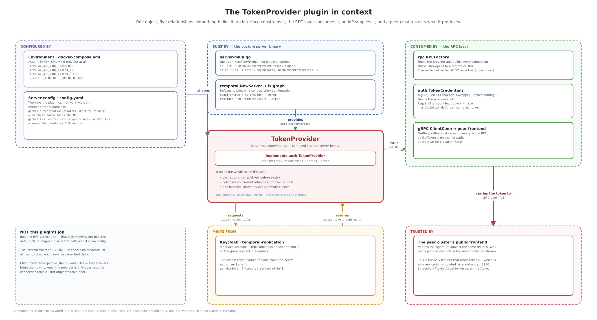
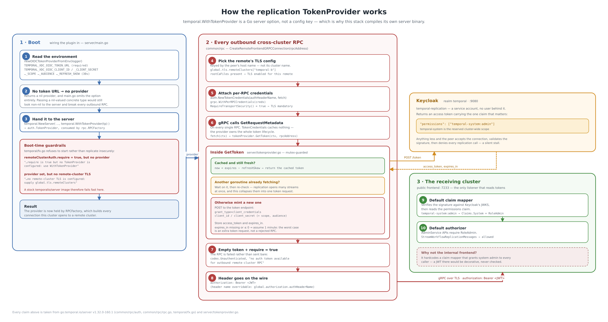

# Temporal cross-cluster replication secured with a Keycloak JWT

Two Temporal clusters running locally in Docker, replicating to each other, with
Keycloak-issued JWTs as the credential everywhere — for people, for SDK clients,
and for the replication stream between the clusters.

The replication stream authenticates with a token minted by a **`TokenProvider`
plugin compiled into the server**. TLS is on every connection, but no client
certificates are issued or asked for anywhere: TLS encrypts and proves the
*server's* identity, and the token identifies the caller.



| | cluster-a | cluster-b |
|---|---|---|
| Frontend (gRPC) | `localhost:7233` | `localhost:8233` |
| Internal frontend (no host port) | `temporal:7236` | `temporal-b:7236` |
| Web UI | http://localhost:8080 | http://localhost:8081 |
| Server metrics | http://localhost:8002/metrics | http://localhost:8003/metrics |
| Elasticsearch | `localhost:9200` | `localhost:9201` |
| Initial failover version | 1 | 2 |

Shared by both: Keycloak (http://localhost:9080), Prometheus
(http://localhost:9090), Grafana (http://localhost:8085).

Both Web UIs require a Keycloak sign-in — **`temporal` / `temporal`** — because
the frontends validate a JWT on every call. See
[Using the Web UI](#using-the-web-ui).

### What's where

| Path | |
|---|---|
| `docker-compose.yml` | cluster-a, plus the shared Keycloak, Prometheus and Grafana |
| `docker-compose.cluster-b.yml` | cluster-b, the replication peer |
| `server/` | the Temporal server binary, built with the replication `TokenProvider` |
| `config/cluster-a/config.yaml`, `config/cluster-b/config.yaml` | each cluster's server configuration |
| `scripts/generate-certs.sh` | the self-signed CA and both clusters' server certificates |
| `scripts/setup-keycloak.sh` | the realm and the two OIDC clients |
| `scripts/connect-clusters.sh` | joins the clusters and creates a global namespace |
| `scripts/verify-replication.sh` | the end-to-end check |
| `scripts/token.sh` | mints an access token; handy inside the admin-tools containers |
| `docs/architecture.png` | the diagram above (`.svg` alongside it is the vector original) |
| `docs/tokenprovider-context.png` | the TokenProvider's relationships with everything around it |
| `docs/tokenprovider.png` | how the TokenProvider works, step by step |
| `docs/*.py` | the diagram layouts; regenerate with `./scripts/render-diagram.sh` |

## Prerequisites

- [Docker](https://docs.docker.com/engine/install/) (includes Docker Compose)
- `openssl`, `curl`, `python3` — used by the setup scripts

## Quick start

```bash
# 1. the PKI both clusters serve TLS with
./scripts/generate-certs.sh

# 2. the realm and the two OIDC clients; writes both secrets into .env
docker compose up -d keycloak
./scripts/setup-keycloak.sh

# 3. cluster-a (this also builds the server image — the first build is slow,
#    it compiles the Temporal server from source)
docker compose up -d

# 4. cluster-b
docker compose -f docker-compose.cluster-b.yml up -d

# 5. join them and create a global namespace on both
./scripts/connect-clusters.sh

# 6. check the whole thing
./scripts/verify-replication.sh
```

Step 5 takes a couple of minutes: each frontend caches the cluster list and
only refreshes it every `system.clusterMetadataRefreshInterval` (a minute by
default), so the script retries the namespace creation until cluster-a has
noticed cluster-b.

## How it fits together

Three kinds of traffic reach these clusters. All three are encrypted and all
three verify the server they are talking to. What differs is what identifies
the *caller*.

**The public frontend (7233)** is what people, SDK clients and the peer
cluster's replication stream all use. It runs the `default` claim mapper and
the `default` authorizer, so every call must carry a Keycloak JWT: the
signature is checked against the realm's JWKS, the `permissions` claim becomes
the caller's roles, and the authorizer decides from there.

**The internal frontend (7236)** exists for each cluster's own system workers,
which have no user behind them and no token to carry. Temporal wires it with a
claim mapper that treats every caller as the server itself, so it grants system
admin without looking at credentials at all.

**Replication** goes to the public frontend, on the same port and through the
same authorization path as everyone else, carrying a token minted by the
`TokenProvider`.

### The TokenProvider



A `TokenProvider` is a Go server option, not a config key:

```go
temporal.WithTokenProvider(tokenProvider)   // go.temporal.io/server/temporal
```

so there is no YAML-only path to any of this — the stack builds its own server
binary from [server/](server/). [server/main.go](server/main.go) is upstream
`cmd/server/main.go` plus that one option;
[server/tokenprovider.go](server/tokenprovider.go) is the plugin.

The interface the server calls is one method:

```go
// go.temporal.io/server/common/rpc/auth
type TokenProvider interface {
    GetToken(ctx context.Context, rpcAddress string) (token string, err error)
}
```



It is called on **every** outbound cross-cluster RPC, which is why the provider
caches internally and collapses concurrent refreshes — without that, every
replication task would be a round trip to Keycloak. The grant is
`client_credentials`: replication has no user behind it, so each cluster
authenticates as the service account of the `temporal-replication` client.

Three details are easy to get wrong:

- **TLS is mandatory, not optional.** The server attaches the token through
  gRPC `PerRPCCredentials` whose `RequireTransportSecurity()` returns `true`
  (RFC 9700), so a plaintext cross-cluster dial cannot carry a token at all.
  What marks a remote as TLS-enabled is the presence of `rootCaFiles` under
  `global.tls.remoteClusters.<peer-host>`; drop it and every cross-cluster RPC
  fails.
- **The map is keyed by host name, not cluster name.** `global.tls.remoteClusters`
  is keyed by the host part of the address passed to `operator cluster upsert`
  (`temporal-b`), not by the cluster's name (`cluster-b`).
- **`remoteClusterAuth.require: true` is a boot check as well as a runtime one.**
  It fails outbound RPCs that have no token, and refuses to start the server
  when no `TokenProvider` was compiled in — so running a stock
  `temporalio/server` image against these configs is an immediate boot failure
  rather than silently unauthenticated replication.

### Why replication lands on the public frontend

The obvious place for replication is the internal frontend: it already exists
for machine traffic. It is the wrong place for a token, because the internal
frontend does not read tokens — the claim mapper it hardcodes returns system
admin for every caller regardless of what they present. That is what makes it
usable for system workers, and it is exactly what would make a JWT there
decorative.

The public frontend validates the signature, extracts `permissions`, and denies
AdminService calls to anything without `temporal-system:admin`. So that is
where `clusterMetadata.clusterInformation.<self>.rpcAddress` points.

### Cluster metadata

```yaml
clusterMetadata:
    enableGlobalNamespace: true
    failoverVersionIncrement: 10
    masterClusterName: "cluster-a"     # cluster-b names itself
    currentClusterName: "cluster-a"
    clusterInformation:
        cluster-a:                     # only ever the local cluster
            enabled: true
            initialFailoverVersion: 1  # cluster-b takes 2
            rpcName: "frontend"
            rpcAddress: "temporal:7233"
            httpAddress: "temporal:7243"
```

- **Both clusters must agree on `failoverVersionIncrement`, and each must claim
  a distinct `initialFailoverVersion` below it.** Failover versions are minted
  as `initialFailoverVersion + n × failoverVersionIncrement`, and that is what
  lets either side look at a history event and decide which cluster's version
  wins. You can watch the arithmetic during a failover — see
  [Failing over](#failing-over).
- **Only the local cluster is listed.** Remote clusters in static config are
  deprecated and ignored — the server says so in its log ("All remote cluster
  settings under ClusterMetadata.ClusterInformation config will be ignored")
  and reads them from the `cluster_metadata` table, which
  `temporal operator cluster upsert` populates at runtime. That is what
  `scripts/connect-clusters.sh` does.
- **`masterClusterName` is each cluster's own name.** Only the master may
  register or reconfigure a global namespace, and the name has to resolve
  inside `clusterInformation` or `cluster.NewMetadata` panics at boot. Since
  `clusterInformation` lists only the local cluster, self is the only value
  that works. This matches the server's own XDC test suite
  (`tests/xdc/base.go`). The cost is that either side will accept
  `namespace create --global`, so pick one cluster and stick to it.

## Testing

### The automated check

```bash
./scripts/verify-replication.sh
```

Twelve checks, ordered by what a failure would tell you:

| | proves |
|---|---|
| 1. TokenProvider enabled on both servers | the plugin is compiled in and picked up its configuration |
| 2. Both public frontends reachable over TLS with a JWT | certificates, JWKS and the claim mapper all line up |
| 3. Both public frontends **reject** a call with no JWT | authorization is actually enforced on the listener replication uses |
| 4. Each cluster sees the other, connection and replication on | `operator cluster upsert` took effect on both sides |
| 5. The global namespace exists on both clusters | namespace metadata crossed the replication stream |
| 6. A workflow started on cluster-a appears on cluster-b | workflow history crosses the stream |

Expected output ends with:

```
12 passed, 0 failed
```

Check 6 needs no worker: an unstarted workflow still has a history, and it is
that history crossing the stream that is being tested.

### Proving the JWT is load-bearing

Check 3 shows a call with *no* token is denied. The stronger question is
whether the receiving cluster checks what is *in* the token, or merely that one
is present. To answer it, give one cluster a valid, correctly-signed token that
lacks `temporal-system:admin` and watch replication break.

```bash
# a service-account client with no permissions mapper
KC=http://localhost:9080
AT=$(curl -sf -X POST "$KC/realms/master/protocol/openid-connect/token" \
  -d grant_type=password -d client_id=admin-cli \
  -d username=admin -d password=admin | python3 -c 'import json,sys;print(json.load(sys.stdin)["access_token"])')

curl -s -X POST "$KC/admin/realms/temporal/clients" \
  -H "Authorization: Bearer $AT" -H 'Content-Type: application/json' \
  -d '{"clientId":"temporal-replication-noperm","enabled":true,"protocol":"openid-connect",
       "publicClient":false,"serviceAccountsEnabled":true,"standardFlowEnabled":false,
       "directAccessGrantsEnabled":false}'

UUID=$(curl -s "$KC/admin/realms/temporal/clients?clientId=temporal-replication-noperm" \
  -H "Authorization: Bearer $AT" | python3 -c 'import json,sys;c=json.load(sys.stdin);print(c[0]["id"])')
NOPERM=$(curl -s "$KC/admin/realms/temporal/clients/$UUID/client-secret" \
  -H "Authorization: Bearer $AT" | python3 -c 'import json,sys;print(json.load(sys.stdin)["value"])')

# point cluster-b's replication identity at it
cat > /tmp/override-noperm.yml <<EOF
services:
  temporal-b:
    environment:
      - TEMPORAL_XDC_OIDC_CLIENT_ID=temporal-replication-noperm
      - TEMPORAL_XDC_OIDC_CLIENT_SECRET=$NOPERM
EOF
docker compose -f docker-compose.cluster-b.yml -f /tmp/override-noperm.yml up -d temporal-b

# make cluster-b dial cluster-a
source .env
TOKEN=$(curl -sf -X POST "$KC/realms/temporal/protocol/openid-connect/token" \
  -d grant_type=client_credentials -d client_id=temporal-app \
  -d "client_secret=$KEYCLOAK_CLIENT_SECRET" | python3 -c 'import json,sys;print(json.load(sys.stdin)["access_token"])')
docker run --rm --network temporal-network -v "$PWD/certs:/certs:ro" \
  temporalio/admin-tools:1.31.0 temporal operator cluster upsert \
  --frontend-address temporal:7233 --enable-connection --enable-replication \
  --address temporal-b:7233 --tls --tls-ca-path /certs/ca/ca.pem \
  --tls-server-name temporal-b --grpc-meta authorization="Bearer $TOKEN"
```

The signature is valid, the issuer is the same realm, TLS succeeds — and it
still fails:

```
Error: unable to upsert cluster: Unable connect to remote cluster temporal:7233 with error: Request unauthorized..
```

Restore afterwards:

```bash
docker compose -f docker-compose.cluster-b.yml up -d temporal-b
curl -s -X DELETE "$KC/admin/realms/temporal/clients/$UUID" -H "Authorization: Bearer $AT"
```

### Talking to the clusters by hand

Every call to a public frontend needs the CA (to verify the server) and a
bearer token (to identify the caller). The admin-tools containers have both a
token minter and the CA mounted:

```bash
docker compose exec temporal-admin-tools sh
export TEMPORAL_GRPC_META_AUTHORIZATION="Bearer $(/scripts/token.sh)"

temporal operator cluster list
temporal operator namespace describe -n replicated
temporal workflow list -n replicated
```

`TEMPORAL_ADDRESS`, `TEMPORAL_TLS_CA_PATH` and `TEMPORAL_TLS_SERVER_NAME` are
already set in those containers. Use `temporal-b-admin-tools` for cluster-b.

To inspect what is actually in a token:

```bash
source .env
curl -s -X POST http://localhost:9080/realms/temporal/protocol/openid-connect/token \
  -d grant_type=client_credentials -d client_id=temporal-replication \
  -d "client_secret=$KEYCLOAK_REPLICATION_SECRET" \
| python3 -c 'import base64,json,sys; t=json.load(sys.stdin)["access_token"]; p=t.split(".")[1]; p+="="*(-len(p)%4); print(json.dumps(json.loads(base64.urlsafe_b64decode(p)), indent=2))'
```

The claim that matters is `"permissions": ["temporal-system:admin"]`.
`temporal-system` is the reserved namespace name the default claim mapper reads
as a cluster-wide scope, and `admin` is the level AdminService APIs such as
`StreamWorkflowReplicationMessages` require. Anything less and the peer accepts
the connection, validates the signature, and then denies every replication
call — which looks like a silent replication stall rather than an auth error.

### Failing over

This is also the clearest way to see the failover-version configuration doing
its job.

```bash
# in temporal-admin-tools, with TEMPORAL_GRPC_META_AUTHORIZATION set:
temporal operator namespace describe -n replicated | grep -E "ActiveClusterName|FailoverVersion"
#   ReplicationConfig.ActiveClusterName   cluster-a
#   FailoverVersion                       1

temporal operator namespace update -n replicated --active-cluster cluster-b
```

Give it a namespace-cache refresh, then look again on either cluster:

```
ReplicationConfig.ActiveClusterName   cluster-b
FailoverVersion                       2
```

2 is cluster-b's `initialFailoverVersion`. Fail back to cluster-a and it
becomes **11** — `initialFailoverVersion 1 + 1 × failoverVersionIncrement 10`.
That is the arithmetic that lets either cluster decide whose history wins.

### Using the Web UI

Both UIs sign users in through the same Keycloak realm and forward the
resulting token to their cluster's frontend, so they work as soon as the stack
is up. Open http://localhost:8080 (cluster-a) or http://localhost:8081
(cluster-b) and sign in with:

```
temporal / temporal
```

Three settings make this work, and each fails in its own distinctive way if it
is missing:

| Setting | Why |
|---|---|
| `KC_HOSTNAME=http://localhost:9080` on Keycloak | pins front-channel URLs, so the browser is redirected somewhere it can actually resolve |
| `KC_HOSTNAME_BACKCHANNEL_DYNAMIC=true` | lets the UI container keep using `keycloak:9080` for discovery and the code-for-token exchange |
| `TEMPORAL_AUTH_ISSUER_URL` on each UI | the UI fetches discovery from `keycloak:9080` but the document names the issuer as `localhost:9080`; without stating the expected issuer the UI exits at boot with `oidc: issuer did not match` |

plus an **audience mapper** on the `temporal-app` client, added by
`scripts/setup-keycloak.sh`. The UI verifies the token it forwards using an
OIDC verifier that insists on seeing its own client id in `aud`, and Keycloak's
default audience is `account` — so without the mapper every UI call fails with
`oidc: expected audience "temporal-app" got ["account"]` even though the token
is entirely valid. The Temporal server itself does not check `aud`, so the
mapper is purely additive.

The permissions mapper is hardcoded on the client, so any user who signs in
gets `temporal-system:admin`. Fine for a lab; in anything real the claim should
come from the user's own roles.

## Troubleshooting

| Symptom | Cause |
|---|---|
| `panic: duplicate InitialFailoverVersion 1 for clusters "cluster-a" and "active"` | a stale row in `cluster_metadata_info` from an earlier run under a different cluster name. Cluster identity is persisted, so changing it needs a fresh database: `docker compose down -v` on both stacks |
| `Expected version: 1.19 cannot be greater than Actual version: 0.0` | the server started before the schema migration finished. Both compose files gate the server on `service_completed_successfully`, so this should not recur — if it does, check `docker logs temporal-setup` |
| `global.authorization.remoteClusterAuth.require is true but no TokenProvider is configured` | the server was started from a stock `temporalio/server` image instead of the one built from `server/` |
| `WithTokenProvider is set but no remote-cluster TLS is configured` | `global.tls.remoteClusters` is missing or its entry has no `rootCaFiles` |
| `Request unauthorized` on a cross-cluster call | the replication token is missing `permissions: ["temporal-system:admin"]` — re-run `./scripts/setup-keycloak.sh` |
| `Invalid cluster name` when creating the global namespace | the frontend has not refreshed its cluster list yet. `connect-clusters.sh` retries this for three minutes |
| `KEYCLOAK_CLIENT_SECRET is not set` | `./scripts/setup-keycloak.sh` has not run, or `.env` was regenerated from `.env.example` afterwards |
| Web UI container exits with `oidc: issuer did not match the issuer returned by provider` | `TEMPORAL_AUTH_ISSUER_URL` is missing or does not match Keycloak's advertised issuer (`http://localhost:9080/realms/temporal`) |
| Web UI loads but shows no data, and its log says `oidc: expected audience "temporal-app" got ["account"]` | the audience mapper is missing from the `temporal-app` client — re-run `./scripts/setup-keycloak.sh` |
| Web UI loads but every panel is empty, with nothing in its own log | the UI is running without SSO, so the frontend refuses its calls. Check the `TEMPORAL_AUTH_*` block on the UI service |

Useful logs:

```bash
docker logs temporal   2>&1 | grep -iE "token provider|replicat"
docker logs temporal-b 2>&1 | grep -iE "token provider|replicat"
```

## What this trades away

Be clear-eyed about this before copying any of it anywhere real.

**No client certificates anywhere.** Every listener runs with
`requireClientAuth: false`. TLS encrypts the channel and proves the server's
identity; it says nothing about the caller. On the public frontend that is
fine — the JWT identifies the caller. On the internode and internal-frontend
listeners there is now no caller identity at all.

**The internal frontend has no credential.** It hardcodes a claim mapper that
grants system admin to every caller, and mTLS used to be the thing guarding it.
It no longer is: anything that can open a connection to port 7236 gets system
admin on that cluster. Nothing publishes the port to the host, so the blast
radius is whatever else sits on `temporal-network` — acceptable for a local
lab, and the first thing to fix in anything that is not one.

**One service account for both clusters.** Symmetric trust, and one secret to
rotate. Give each cluster its own OIDC client if you want to revoke one side
without stopping the other.

**Both clusters are their own master.** Either will accept
`namespace create --global`, and nothing stops the two from disagreeing.

**Private keys are world-readable** (`chmod 644`), because the server reads them
as uid 1000 through a read-only bind mount.

## Teardown

```bash
docker compose -f docker-compose.cluster-b.yml down -v
docker compose down -v
```

`-v` matters: cluster identity and the registered peer list live in PostgreSQL,
so leaving the volumes behind is what produces the `duplicate
InitialFailoverVersion` panic on the next run with different names.
